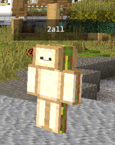

# prismarine-viewer | @djmahirnationtv

Web based viewer for servers and bots

What has been changed?:

- Skins Support (Also supports Offline Servers and Online Servers)
- Better Nametag reading


[](https://prismarinejs.github.io/prismarine-viewer/)

Supports versions 1.8.8, 1.9.4, 1.10.2, 1.11.2, 1.12.2, 1.13.2, 1.14.4, 1.15.2, 1.16.1, 1.16.4, 1.17.1, 1.18.1, 1.19, 1.20.1, 1.21.1, 1.21.4.

## Install

```bash
npm install @djmahirnationtv/prismarine-viewer
```

## Example

```js
const mineflayer = require('mineflayer')
const mineflayerViewer = require('@djmahirnationtv/prismarine-viewer').mineflayer

const bot = mineflayer.createBot({
  username: 'DJMahirNationTV'
})

bot.once('spawn', () => {
  mineflayerViewer(bot, { port: 3000 }) // Start the viewing server on port 3000

  // Draw the path followed by the bot
  const path = [bot.entity.position.clone()]
  bot.on('move', () => {
    if (path[path.length - 1].distanceTo(bot.entity.position) > 1) {
      path.push(bot.entity.position.clone())
      bot.viewer.drawLine('path', path)
    }
  })
})
```

## API

### @djmahirnationtv/prismarine-viewer

#### viewer

The core rendering library. It provides Viewer and WorldView which together make it possible to render a minecraft world.
Check its [API](viewer/README.md)

#### mineflayer

Serve a webserver allowing to visualize the bot surrounding, in first or third person. Comes with drawing functionnalities.

```js
const { mineflayer } = require('@djmahirnationtv/prismarine-viewer')
```

Options:
* `viewDistance` view radius, in chunks, default: `6`
* `firstPerson` is the view first person ? default: `false`
* `port` the port for the webserver, default: `3000`

[example](https://github.com/PrismarineJS/prismarine-viewer/blob/master/examples/bot.js)

#### standalone

Serve a webserver allowing to visualize a world.

```js
const { standalone } = require('@djmahirnationtv/prismarine-viewer')
```

Options:
* `version` the version to use, default: `1.13.2`
* `generator` a world generator function, default: `(x, y, z) => 0`
* `center` a vec3 to center the view on, default: `new Vec3(0, 0, 0)`
* `viewDistance` view radius, in chunks, default: `6`
* `port` the port for the webserver, default: `3000`

[example](https://github.com/PrismarineJS/prismarine-viewer/blob/master/examples/standalone.js)

#### headless

Render the bot view and stream it to a file or over TCP.

```js
const { headless } = require('@djmahirnationtv/prismarine-viewer')
```

Options:
* `viewDistance` view radius, in chunks, default: `6`
* `output` the output file or a `host:port` address to stream to, default: `output.mp4`
* `frames` number of frames to record, `-1` for infinite, default: `200`
* `width` the width of a frame, default: `512`
* `height` the height of a frame, default: `512`

[example](https://github.com/PrismarineJS/prismarine-viewer/blob/master/examples/headless.js)

### Drawing (mineflayer mode)

All drawing function have a unique id that can be used to replace or erase the primitive.

#### bot.viewer.drawLine (id, points, color=0xff0000)

Draw a line passing through all the `points`.

#### bot.viewer.erase (id)

Remove the primitive with the given id from the display.

#### bot.viewer.close ()

Stop the server and disconnect users.